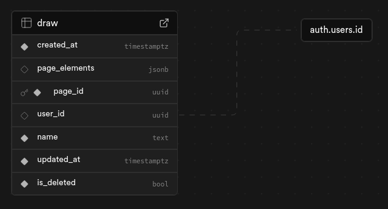

## Supabase Setup and Schema

### Structure

The structure of the database is meant to make it super easy and secure to get Draw up and running.
[](./assets/Draw-Readme-DB-Schema.png)

### Instructions

To get started, first create a Supabase Account and a new project.

Go to the SQL Editor and run the following SQL Queries:

Create the table

```
CREATE TABLE draw (
  created_at timestamp with time zone NOT NULL DEFAULT now(),
  page_elements jsonb NULL,
  page_id uuid NOT NULL DEFAULT gen_random_uuid(),
  user_id uuid NULL,
  name text NOT NULL DEFAULT 'New Page',
  updated_at timestamp with time zone NOT NULL DEFAULT now(),
  is_deleted boolean NOT NULL DEFAULT false,
  CONSTRAINT draw_pkey PRIMARY KEY (page_id),
  CONSTRAINT draw_user_id_fkey FOREIGN KEY (user_id) REFERENCES auth.users(id) ON UPDATE CASCADE
);
```

Enable RLS (read more about RLS [here](https://supabase.com/docs/guides/database/postgres/row-level-security))

```
alter table "draw" enable row level security;
```

Add the RLS Policies

```
CREATE POLICY "Enable read access for all users" ON draw
FOR SELECT
TO public
USING (true);

CREATE POLICY "Enable insert for authenticated users only" ON draw
FOR INSERT
TO authenticated
WITH CHECK (true);

CREATE POLICY "Enable update for authenticated users only" ON draw
FOR UPDATE
TO authenticated
USING ((select auth.uid()) = user_id)
WITH CHECK (true);

CREATE POLICY "Enable delete for users based on user_id" ON draw
FOR DELETE
TO authenticated
USING ((select auth.uid()) = user_id);
```
